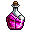
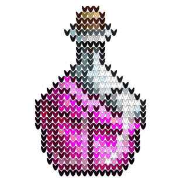

# cross-stitch

A simple rust program, which repeats an svg tile for each pixel of an input image.

For example, this input:
 

Will give an output like this:

## Credits ##

- Image decoding by [image-rs](https://github.com/image-rs/image)
- Example input image by [CraftPix.net](https://opengameart.org/content/48-free-magic-potions-pixel-art-icons)
